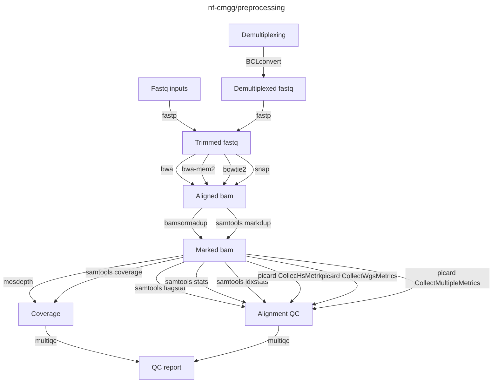

[](https://github.com/nf-cmgg/preprocessing/actions/workflows/ci.yml)
[](https://github.com/nf-cmgg/preprocessing/actions/workflows/linting.yml)
[](https://www.nextflow.io/)
[](https://docs.conda.io/en/latest/)
[](https://www.docker.com/)
[](https://sylabs.io/docs/)

## Introduction

**nf-cmgg/preprocessing** is a bioinformatics pipeline that demultiplexes and aligns raw sequencing data.
It also performs basic QC and coverage analysis.
The pipeline is built using Nextflow, a workflow tool to run tasks across multiple compute infrastructures in a very portable manner. It comes with docker containers making installation trivial and results highly reproducible.

Steps inlcude:

1. Demultiplexing using [`BCLconvert`](https://emea.support.illumina.com/sequencing/sequencing_software/bcl-convert.html)
2. Read QC and trimming using [`fastp`](https://github.com/OpenGene/fastp)
3. Alignment using either [`bwa`](), [`bwa-mem2`](https://github.com/bwa-mem2/bwa-mem2), [`bowtie2`](https://github.com/BenLangmead/bowtie2) or [`snap`](https://github.com/amplab/snap)
4. Duplicate marking using [`bamsormadup`](https://gitlab.com/german.tischler/biobambam2) or [`samtools markdup`](http://www.htslib.org/doc/samtools-markdup.html)
5. Coverage analysis using [`mosdepth`](https://github.com/brentp/mosdepth) and [`samtools coverage`](http://www.htslib.org/doc/samtools-coverage.html)
6. Alignment QC using [`samtools flagstat`](http://www.htslib.org/doc/samtools-flagstat.html), [`samtools stats`](http://www.htslib.org/doc/samtools-stats.html), [`samtools idxstats`](http://www.htslib.org/doc/samtools-idxstats.html) and [`picard CollecHsMetrics`](https://broadinstitute.github.io/picard/command-line-overview.html#CollectHsMetrics), [`picard CollectWgsMetrics`](https://broadinstitute.github.io/picard/command-line-overview.html#CollectWgsMetrics), [`picard CollectMultipleMetrics`](https://broadinstitute.github.io/picard/command-line-overview.html#CollectMultipleMetrics)
7. QC aggregation using [`multiqc`](https://multiqc.info/)



## Usage

> [!NOTE]
> If you are new to Nextflow and nf-core, please refer to [this page](https://nf-co.re/docs/usage/installation) on how to set-up Nextflow. Make sure to [test your setup](https://nf-co.re/docs/usage/introduction#how-to-run-a-pipeline) with `-profile test` before running the workflow on actual data.

First, prepare a samplesheet with your input data that looks as follows:

`samplesheet.csv` for fastq inputs:

```csv
id,samplename,organism,library,fastq_1,fastq_2
sample1,sample1,Homo sapiens,Library_Name,reads1.fq.gz,reads2.fq.gz
```

`samplesheet.csv` for flowcell inputs:

```csv
id,samplesheet,lane,flowcell,sample_info
flowcell_id,/path/to/illumina_samplesheet.csv,1,/path/to/sequencer_uploaddir,/path/to/sampleinfo.csv
```

`sampleinfo.csv` for use with flowcell inputs:

```csv
samplename,library,organism,tag
fc_sample1,test,Homo sapiens,WES
```

Now, you can run the pipeline using:

```bash
nextflow run nf-cmgg/preprocessing \
   -profile <docker/singularity/.../institute> \
   --igenomes_base /path/to/genomes \
   --input samplesheet.csv \
   --outdir <OUTDIR>
```

> [!WARNING]
> Please provide pipeline parameters via the CLI or Nextflow `-params-file` option. Custom config files including those provided by the `-c` Nextflow option can be used to provide any configuration _**except for parameters**_;
> see [docs](https://nf-co.re/usage/configuration#custom-configuration-files).

## Credits

nf-cmgg/preprocessing was originally written by the CMGG ICT team.

## Support

This pipeline uses code and infrastructure developed and maintained by the [nf-core](https://nf-co.re) community, reused here under the [MIT license](https://github.com/nf-core/tools/blob/master/LICENSE).

> **The nf-core framework for community-curated bioinformatics pipelines.**
>
> Philip Ewels, Alexander Peltzer, Sven Fillinger, Harshil Patel, Johannes Alneberg, Andreas Wilm, Maxime Ulysse Garcia, Paolo Di Tommaso & Sven Nahnsen.
>
> _Nat Biotechnol._ 2020 Feb 13. doi: [10.1038/s41587-020-0439-x](https://dx.doi.org/10.1038/s41587-020-0439-x).
